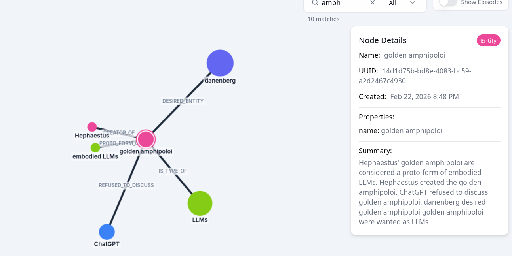

# zep-mcp

Minimal MCP server for [Zep Cloud](https://www.getzep.com/) -- exposes a
temporal knowledge graph as three tools: `add_memory`, `search_memory`, and
`list_memory`.

Zep Cloud is built on [Graphiti](https://github.com/getzep/graphiti), an
open-source temporal knowledge graph framework. Unlike flat memory stores,
Zep extracts entities and relationships from text, tracks how facts evolve
over time (valid/invalid timestamps), and supports hybrid search (semantic
+ BM25 keyword + graph traversal).



## Tools

| Tool | Description |
|------|-------------|
| `add_memory(content)` | Add text to the knowledge graph. Zep extracts entities and relationships automatically. |
| `search_memory(query, limit=10)` | Graph-informed search. Returns full episode text ranked by hybrid relevance (semantic + keyword + KG traversal). |
| `list_memory(limit=50)` | List recent memories (episodes) without a specific query. For "what do you know about me?" |

## Setup

```bash
# Install as a tool (recommended)
uv tool install "git+https://github.com/klutometis/zep-mcp.git"

# Or clone for development
git clone https://github.com/klutometis/zep-mcp.git
cd zep-mcp
uv sync
```

## Usage

### Standalone (stdio)

```bash
ZEP_API_KEY=z_... ZEP_USER_ID=danenberg zep-mcp
```

### With uvx (no install needed)

```bash
ZEP_API_KEY=z_... ZEP_USER_ID=danenberg \
  uvx --from "git+https://github.com/klutometis/zep-mcp.git" zep-mcp
```

### With MCP Inspector

- Transport: **STDIO**
- Command: `uvx`
- Args: `--from git+https://github.com/klutometis/zep-mcp.git zep-mcp`
- Env: `ZEP_API_KEY`, `ZEP_USER_ID`

### With an MCP gateway / client config

```json
{
  "zep": {
    "command": "uvx",
    "args": [
      "--from", "git+https://github.com/klutometis/zep-mcp.git", "zep-mcp"
    ],
    "env": {
      "ZEP_API_KEY": "z_...",
      "ZEP_USER_ID": "danenberg"
    }
  }
}
```

## Environment variables

| Variable | Required | Description |
|----------|----------|-------------|
| `ZEP_API_KEY` | Yes | Zep Cloud API key (starts with `z_`) |
| `ZEP_USER_ID` | No | User ID for graph scoping (default: `"default"`) |

The server creates the Zep user on startup if it doesn't exist (idempotent).

## Importing memories

A migration script is included for importing from OpenMemory (or any JSON
array of `{"content": "..."}` objects):

```bash
ZEP_API_KEY=z_... ZEP_USER_ID=danenberg \
  uv run python import-memories.py /path/to/export.json
```

Options:

| Flag | Description |
|------|-------------|
| `--nuke` | Delete user and recreate before importing (clean slate) |
| `--delay N` | Seconds between API calls (default: 0.5) |
| `--resume N` | Skip first N records (resume after partial import) |

## Architecture

```
Zep Cloud (Graphiti engine)          This server              Your client
┌────────────────────────┐      ┌──────────────────┐      ┌──────────────┐
│  Temporal knowledge    │      │  zep_mcp.py      │      │  Claude,     │
│  graph: entities,      │◄────►│  (FastMCP, stdio) │◄────►│  gateway,   │
│  relationships, facts  │      │  3 tools         │      │  Inspector   │
└────────────────────────┘      └──────────────────┘      └──────────────┘
         HTTPS                         stdio
```
